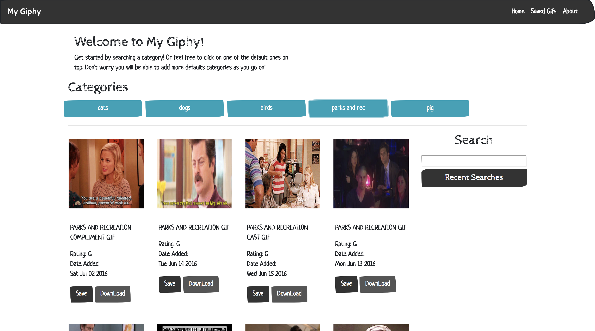

# My Giphy

[Visit the app](https://germangamboa95.github.io/giphyProject.io/)

The aim of this app is to have a place where people can look up gifs based on their search criteria. The user will be able to add default search criterion. The user will also be able to save favorites so they can come back for them later. The user will also be able to download the image.

## Possible future features: 

* Add the ability to have users. 

## The toughest challenge encountered: 

Downloading the images requires them to be converted to base64 using the browsers file api. I had to learn to use the file api in order to complete that part. 

